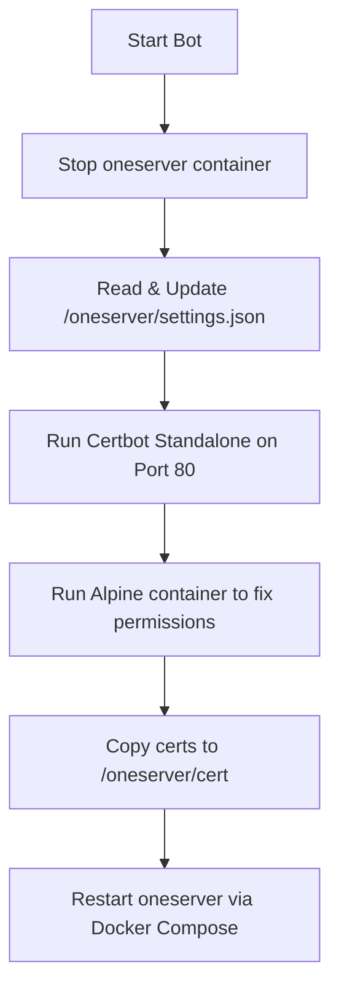

# oneserver-certbot

*Automated SSL/TLS certificate generation and renewal for oneserver deployment*

`oneserver-certbot` is a Python-based wrapper utility designed to automate the process of obtaining and renewing Let's Encrypt SSL certificates for your `oneserver` instance. It runs in a Docker container, communicates with the host's Docker daemon, coordinates standalone Certbot certificate generation, configures SSL parameters, and restarts the `oneserver` stack automatically.

---

## How It Works

The bot coordinates a multi-step workflow to safely provision certificates:



1. **Stop Server**: Stops the running `oneserver` container to free up port 80 for the Certbot standalone challenge.
2. **Configure Settings**: Reads `/oneserver/settings.json`, configures any domain with `type: "https"` to use the standard certificate paths (`fullchain.pem` and `privkey.pem`), and writes the updated settings back.
3. **Run Certbot**: Launches a sibling `certbot/certbot` container in standalone mode on port 80 to obtain certificates from Let's Encrypt for all HTTPS domains.
4. **Fix Permissions**: Launches a sibling `alpine` container to recursively adjust certificate file permissions (`chmod -R 777`) so they can be read by both the host and other containers.
5. **Copy Certificates**: Copies `fullchain.pem` and `privkey.pem` from the Certbot volume into the `oneserver` certificate directory.
6. **Restart Stack**: Runs `docker compose up -d --build` inside the `/oneserver` directory to bring the main server stack back online with the new certificates.

---

## Setup & Configuration

### Prerequisites
- Docker and Docker Compose installed on the host machine.
- Port 80 must be open and accessible from the public internet (necessary for Let's Encrypt HTTP-01 challenge verification).

### Service Configuration

The bot uses Docker-outside-of-Docker (DooD) by mounting the host's Docker socket. This allows it to spin up sibling containers on the host.

Here is the `docker-compose.yml` service definition:

```yaml
services:
  oneserver-certbot:
    build:
      context: .
    environment:
      - HOST_PWD=${PWD}
      - ONESERVER_PWD=${PWD}/../oneserver
    volumes:
      - /var/run/docker.sock:/var/run/docker.sock
      - ../oneserver:/oneserver
      - ./cert:/app/cert
```

> [!IMPORTANT]
> The environment variable `HOST_PWD` is critical. It must point to the absolute path of the `oneservercertbot` directory on the host machine, because sibling containers spawned via the Docker socket require host-system paths for volume bindings.

---

## Usage

To start the certificate generation/renewal process, simply execute the helper run script:

```bash
./run.sh
```

Or run it directly using Docker Compose:

```bash
docker compose run --rm oneserver-certbot
```

> [!WARNING]
> Running this utility will temporarily stop the `oneserver` service while Certbot performs the HTTP-01 challenge on port 80. Ensure you run this during a maintenance window or when temporary downtime is acceptable.
